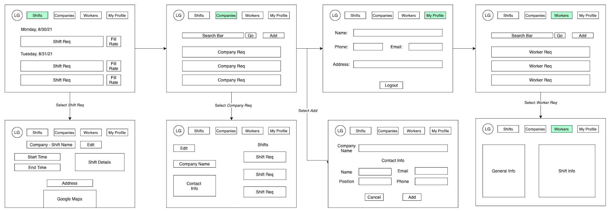

# Schedulr

## About

Schedulr is a web-based application that allows temporary staffing companies to post available shifts and track metrics accross shifts, clients, and their workforce. My goal is to provide staffing agencies with an easier scheduling and tracking process with metric tracking to empower agencies to better understand their market health.

## Most Recent Developments
 - Reporting Suite
 - Metric Visualization Tools
 - Enhanced Logic and QOL Improvements
 - Improved Staff Management on Orders

## Future Development Goals

 - Worker Portal & Functionality
 - User Authentication
 - Filtering
 - More Robust Metrics
 - Further QOL Improvements

## Stack

 - Front-end: 
    - React.js
 - Back-end: 
    - Django
 - Database
    - PostgreSQL

## Libraries & API's
- Kendo React Library
   > Used for data visualization.
   > [Install Guide](https://www.telerik.com/kendo-react-ui/getting-started/)
- Hammer.js Library
  > Used for enhanced gestures in Kendo React charts.
  > [NPM Install](https://www.npmjs.com/package/hammerjs)
- JS File Download Library
  > Used for csv downloading of reports.
  > [NPM Install](https://www.npmjs.com/package/js-file-download)
- Axios
  > Used for API calls.
  > [NPM Install](https://www.npmjs.com/package/axios)
- React Google Maps
  > Enables binding for the Google Maps API into a component.
  > [NPM Install](https://www.npmjs.com/package/@react-google-maps/api)
- Google Maps API
- Google Geocoding API 

## Wireframe

## User Stories

 - As an admin user, I should be able to input a shift with start/end times, the company, location, and all shift details
 - As an admin user, I should be able to see what the fill rate is for each of the posted shifts
 - As an admin user, I should be able to see, edit, and delete all my posted shifts
 - As an admin user, I should be able to add a new company
 - As an admin user, I should be able to see and edit all companies
 - As an admin user, I should be able to see all shifts associated with a company
 - As an admin user, I should be able to see a list of workers
 - As an admin user, I should be able to see a worker's upcoming and past claimed shifts
 - As an admin user, I should be able to logout
 - As an admin user, I should be able to see when a shift was posted

## Learnings & Take-Aways
This truly felt like the culmination of everything I have learned rolled into one project. On paper and in ideation, I found it is easy for me to be ambitious and have rather verbose plans. My initial proposal was to have an admin and worker view and as you can see I had to scale it back and focus on the admin view. That is one my biggest non-technical take-aways from these is to start small and build it up as you go. It can be easy to get carried away but that can make the hill to climb seem that much more daunting when you would be better off with a scaleable approach.

### What went well?
#### React
I am becoming more comfortable with React. With what I know, I am able to quickly get that standing up and hitting my back-end to display data. State Hooks and updating/passing them along through components was a big piece of this and I think it worked out nicely.

#### Shift Creation & Update
While it is not perfect, I am proud of my shift creation workflow. It iterates through the question groupings as the form is filled out so a user is not hit with a giant form right away. There is also logic built-in to handle the processing of an address via Google Geo-Coding API and return lat/lng information before sending to the back-end.

The Shift update form works well too. I made it to a user can enter in their changes, hit save for that specific category, then send it off to the back-end.

### What needs work?
My list could go on and on about what needs work. Most of the time, these projects could never end in that there is always something to be worked on. 

Outside of feature additions, there are a few hiccups along the way that could use improvement. While I am proud of my shift creation workflow, it is as responsive as it should be. Sometimes, you have to hit create twice for it to send to the back-end.
