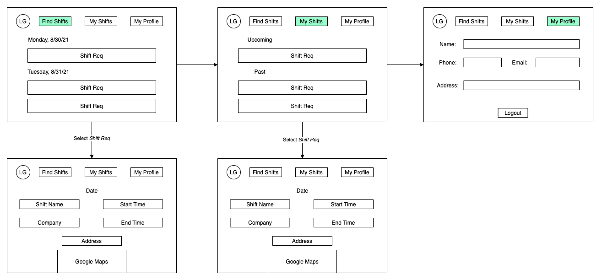

# Schedulr

## About

Schedulr is a web-based application that allows temporary staffing companies to post available shifts and allows users to claim those shifts. Schedulr gives admin the ability to fill all necesarry details about a shift such as the start/end times, description, uniform, etc. Users are then able to view what is available, see where and when the shift is taking place and claim it if they so choose. Schedulr's goal is to provide admins with an easier scheduling process and to provide users with all of the information they need to be succesful.

## Stack

 - Front-end: 
    - React.js
 - Back-end: 
    - Django

## Wireframes
### User View 

### Admin View